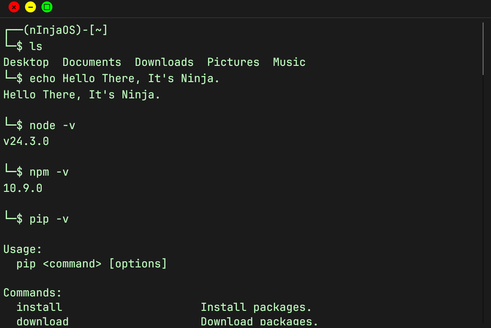

# 🧱 mod_menu: Kali Linux GUI Terminal Emulator for Windows

[](https://www.rust-lang.org/)
[](https://github.com/AaYuSh11233/mod_menu)
[](./LICENSE)

> **A full-featured, visually accurate Kali Linux terminal UI emulator built with Rust + egui/eframe — designed to feel like home for ethical hackers, developers, and students on Windows.**

---

## 🎯 Project Goal

To **faithfully replicate the look and feel of the Kali GNOME terminal** inside a standalone Windows GUI app — while **executing real CMD commands** and **simulating popular Linux shell utilities**.

A hybrid terminal for those who love Linux's aesthetic and power but operate in a Windows environment.

---

## 🖼️ Screenshots

>   
> *Exact reproduction of Kali's red-yellow-green UI elements, green-on-black text, and prompt styling.*

---

## 🔧 Features

| Category         | Feature                                                                 |
|------------------|-------------------------------------------------------------------------|
| 🎨 UI Design      | Custom top bar with **RGB circular buttons** (close, minimize, maximize)|
| ⌨️ Input Style     | Prompt-style input: `┌──(nInjaOS)-[~]` and `└─$`                         |
| 🖋️ Fonts          | `JetBrainsMono` for crisp terminal aesthetics                           |
| 🌌 Color Theme    | Kali-style green on black (low brightness, monospaced text)             |
| 🧠 Command Engine | Real **Windows CMD** integration (`std::process::Command`)               |
| 🐧 Fake Linux Cmd | Simulates `ls`, `clear`, `sudo`, `apt`                                  |
| 🔁 Scroll Buffer  | Full terminal-style output with scrolling & preserved history            |
| 🔒 Focus Control  | Always-on input focus, just like a real terminal                         |

---

## 🛠️ Getting Started

### ⚙️ Prerequisites

| Tool                 | Required |
|----------------------|----------|
| [Rustup](https://rustup.rs)     | ✅ |
| MSVC Build Tools (`cl.exe`, `link.exe`) | ✅ |
| Windows 10 SDK (latest)         | ✅ |
| Visual Studio 2022 Build Tools  | ✅ (C++ + Desktop Dev) |

---

### 🧪 Installation Steps

```bash
git clone https://github.com/AaYuSh11233/mod_menu.git
cd mod_menu
rustup default nightly
cargo run
